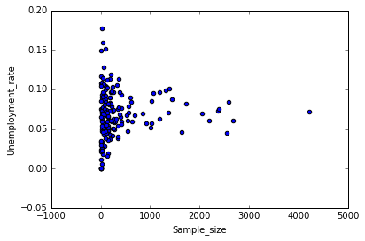
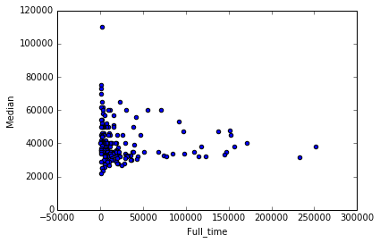
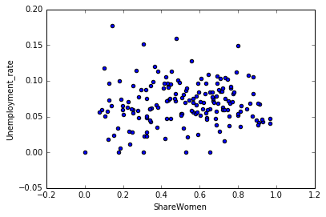
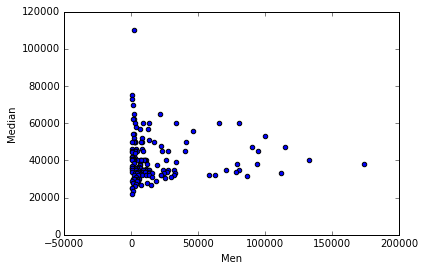
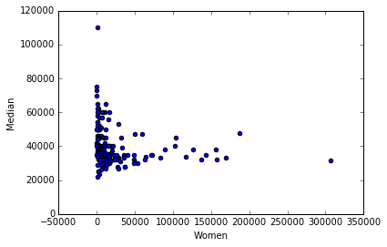
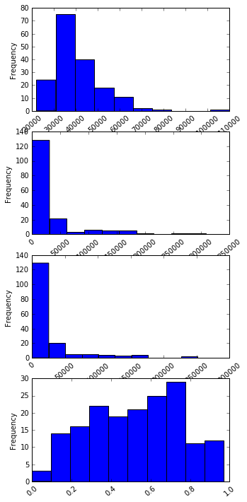
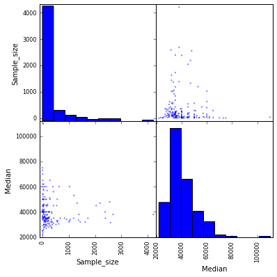
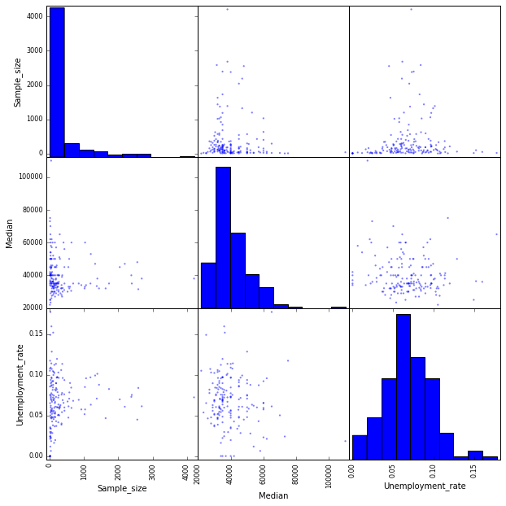
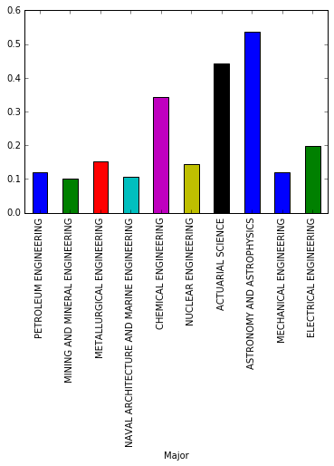

# Dataquest Guided Project: Visualizing Earnings Based On College Majors

#### We'll be working with a dataset on the job outcomes of students who graduated from college between 2010 and 2012. The original data on job outcomes was released by American Community Survey, which conducts surveys and aggregates the data. FiveThirtyEight cleaned the dataset and released it on their Github repo.

#### Each row in the dataset represents a different major in college and contains information on gender diversity, employment rates, median salaries, and more. Here are some of the columns in the dataset:

* **Rank** - Rank by median earnings (the dataset is ordered by this column).
* **Major_code** - Major code.
* **Major** - Major description.
* **Major_category** - Category of major.
* **Total** - Total number of people with major.
* **Sample_size** - Sample size (unweighted) of full-time.
* **Men** - Male graduates.
* **Women** - Female graduates.
* **ShareWomen** - Women as share of total.
* **Employed** - Number employed.
* **Median** - Median salary of full-time, year-round workers.
* **Low_wage_jobs** - Number in low-wage service jobs.
* **Full_time** - Number employed 35 hours or more.
* **Part_time** - Number employed less than 35 hours.

#### Using visualizations, we can start to explore questions from the dataset like:

* Do students in more popular majors make more money?
    * Using scatter plots
* How many majors are predominantly male? Predominantly female?
    * Using histograms
* Which category of majors have the most students?
    * Using bar plots

Setup the environment by importing the libraries we need and running the necessary Jupyter magic so that plots are displayed inline.

* Import pandas and matplotlib into the environment.
    * Run the Jupyter magic %matplotlib inline so that plots are displayed inline.
* Read the dataset into a DataFrame and start exploring the data.
* Read recent-grads.csv into pandas and assign the resulting DataFrame to recent_grads.
    * Use DataFrame.iloc[] to return the first row formatted as a table.
    * Use DataFrame.head() and DataFrame.tail() to become familiar with how the data is structured.
    * Use DataFrame.describe() to generate summary statistics for all of the numeric columns.
* Drop rows with missing values. Matplotlib expects that columns of values we pass in have matching lengths and missing values will cause matplotlib to throw errors.
    * Look up the number of rows in recent_grads and assign the value to raw_data_count.
    * Use DataFrame.dropna() to drop rows containing missing values and assign the resulting DataFrame back to recent_grads.
    * Look up the number of rows in recent_grads now and assign the value to cleaned_data_count. If you compare cleaned_data_count and raw_data_count, you'll notice that only one row contained missing values and was dropped.


```python
import pandas as pd
import matplotlib.pyplot as plt
% matplotlib inline

recent_grads = pd.read_csv('recent-grads.csv')
print(recent_grads.iloc[0])
print(recent_grads.head())
print(recent_grads.tail())
print(recent_grads.describe())
recent_grads = recent_grads.dropna()
```

    Rank                                        1
    Major_code                               2419
    Major                   PETROLEUM ENGINEERING
    Total                                    2339
    Men                                      2057
    Women                                     282
    Major_category                    Engineering
    ShareWomen                           0.120564
    Sample_size                                36
    Employed                                 1976
    Full_time                                1849
    Part_time                                 270
    Full_time_year_round                     1207
    Unemployed                                 37
    Unemployment_rate                   0.0183805
    Median                                 110000
    P25th                                   95000
    P75th                                  125000
    College_jobs                             1534
    Non_college_jobs                          364
    Low_wage_jobs                             193
    Name: 0, dtype: object
       Rank  Major_code                                      Major    Total  \
    0     1        2419                      PETROLEUM ENGINEERING   2339.0   
    1     2        2416             MINING AND MINERAL ENGINEERING    756.0   
    2     3        2415                  METALLURGICAL ENGINEERING    856.0   
    3     4        2417  NAVAL ARCHITECTURE AND MARINE ENGINEERING   1258.0   
    4     5        2405                       CHEMICAL ENGINEERING  32260.0   
    
           Men    Women Major_category  ShareWomen  Sample_size  Employed  \
    0   2057.0    282.0    Engineering    0.120564           36      1976   
    1    679.0     77.0    Engineering    0.101852            7       640   
    2    725.0    131.0    Engineering    0.153037            3       648   
    3   1123.0    135.0    Engineering    0.107313           16       758   
    4  21239.0  11021.0    Engineering    0.341631          289     25694   
    
           ...        Part_time  Full_time_year_round  Unemployed  \
    0      ...              270                  1207          37   
    1      ...              170                   388          85   
    2      ...              133                   340          16   
    3      ...              150                   692          40   
    4      ...             5180                 16697        1672   
    
       Unemployment_rate  Median  P25th   P75th  College_jobs  Non_college_jobs  \
    0           0.018381  110000  95000  125000          1534               364   
    1           0.117241   75000  55000   90000           350               257   
    2           0.024096   73000  50000  105000           456               176   
    3           0.050125   70000  43000   80000           529               102   
    4           0.061098   65000  50000   75000         18314              4440   
    
       Low_wage_jobs  
    0            193  
    1             50  
    2              0  
    3              0  
    4            972  
    
    [5 rows x 21 columns]
         Rank  Major_code                   Major   Total     Men   Women  \
    168   169        3609                 ZOOLOGY  8409.0  3050.0  5359.0   
    169   170        5201  EDUCATIONAL PSYCHOLOGY  2854.0   522.0  2332.0   
    170   171        5202     CLINICAL PSYCHOLOGY  2838.0   568.0  2270.0   
    171   172        5203   COUNSELING PSYCHOLOGY  4626.0   931.0  3695.0   
    172   173        3501         LIBRARY SCIENCE  1098.0   134.0   964.0   
    
                   Major_category  ShareWomen  Sample_size  Employed  \
    168    Biology & Life Science    0.637293           47      6259   
    169  Psychology & Social Work    0.817099            7      2125   
    170  Psychology & Social Work    0.799859           13      2101   
    171  Psychology & Social Work    0.798746           21      3777   
    172                 Education    0.877960            2       742   
    
             ...        Part_time  Full_time_year_round  Unemployed  \
    168      ...             2190                  3602         304   
    169      ...              572                  1211         148   
    170      ...              648                  1293         368   
    171      ...              965                  2738         214   
    172      ...              237                   410          87   
    
         Unemployment_rate  Median  P25th  P75th  College_jobs  Non_college_jobs  \
    168           0.046320   26000  20000  39000          2771              2947   
    169           0.065112   25000  24000  34000          1488               615   
    170           0.149048   25000  25000  40000           986               870   
    171           0.053621   23400  19200  26000          2403              1245   
    172           0.104946   22000  20000  22000           288               338   
    
         Low_wage_jobs  
    168            743  
    169             82  
    170            622  
    171            308  
    172            192  
    
    [5 rows x 21 columns]
                 Rank   Major_code          Total            Men          Women  \
    count  173.000000   173.000000     172.000000     172.000000     172.000000   
    mean    87.000000  3879.815029   39370.081395   16723.406977   22646.674419   
    std     50.084928  1687.753140   63483.491009   28122.433474   41057.330740   
    min      1.000000  1100.000000     124.000000     119.000000       0.000000   
    25%     44.000000  2403.000000    4549.750000    2177.500000    1778.250000   
    50%     87.000000  3608.000000   15104.000000    5434.000000    8386.500000   
    75%    130.000000  5503.000000   38909.750000   14631.000000   22553.750000   
    max    173.000000  6403.000000  393735.000000  173809.000000  307087.000000   
    
           ShareWomen  Sample_size       Employed      Full_time      Part_time  \
    count  172.000000   173.000000     173.000000     173.000000     173.000000   
    mean     0.522223   356.080925   31192.763006   26029.306358    8832.398844   
    std      0.231205   618.361022   50675.002241   42869.655092   14648.179473   
    min      0.000000     2.000000       0.000000     111.000000       0.000000   
    25%      0.336026    39.000000    3608.000000    3154.000000    1030.000000   
    50%      0.534024   130.000000   11797.000000   10048.000000    3299.000000   
    75%      0.703299   338.000000   31433.000000   25147.000000    9948.000000   
    max      0.968954  4212.000000  307933.000000  251540.000000  115172.000000   
    
           Full_time_year_round    Unemployed  Unemployment_rate         Median  \
    count            173.000000    173.000000         173.000000     173.000000   
    mean           19694.427746   2416.329480           0.068191   40151.445087   
    std            33160.941514   4112.803148           0.030331   11470.181802   
    min              111.000000      0.000000           0.000000   22000.000000   
    25%             2453.000000    304.000000           0.050306   33000.000000   
    50%             7413.000000    893.000000           0.067961   36000.000000   
    75%            16891.000000   2393.000000           0.087557   45000.000000   
    max           199897.000000  28169.000000           0.177226  110000.000000   
    
                  P25th          P75th   College_jobs  Non_college_jobs  \
    count    173.000000     173.000000     173.000000        173.000000   
    mean   29501.445087   51494.219653   12322.635838      13284.497110   
    std     9166.005235   14906.279740   21299.868863      23789.655363   
    min    18500.000000   22000.000000       0.000000          0.000000   
    25%    24000.000000   42000.000000    1675.000000       1591.000000   
    50%    27000.000000   47000.000000    4390.000000       4595.000000   
    75%    33000.000000   60000.000000   14444.000000      11783.000000   
    max    95000.000000  125000.000000  151643.000000     148395.000000   
    
           Low_wage_jobs  
    count     173.000000  
    mean     3859.017341  
    std      6944.998579  
    min         0.000000  
    25%       340.000000  
    50%      1231.000000  
    75%      3466.000000  
    max     48207.000000  


#### Scatter Plots in Pandas

###### Generate scatter plots in separate jupyter notebook cells to explore the following relations:
* Sample_size and Median
* Sample_size and Unemployment_rate
* Full_time and Median
* ShareWomen and Unemployment_rate
* Men and Median
* Women and Median
###### Use the plots to explore the following questions:
* Do students in more popular majors make more money?
* Do students that majored in subjects that were majority female make more money?
* Is there any link between the number of full-time employees and median salary?

###### Sample Size and Median Scatter Plot


```python
recent_grads.plot(x='Sample_size', y='Median', kind='scatter')
```


    <matplotlib.axes._subplots.AxesSubplot at 0x7fabec73e9b0>


###### Sample size and Unemployment Rate Scatter Plot


```python
recent_grads.plot(x='Sample_size', y='Unemployment_rate', kind='scatter')
```


    <matplotlib.axes._subplots.AxesSubplot at 0x7fabea43f4e0>





###### Full time and Median Scatter Plot


```python
recent_grads.plot(x='Full_time', y='Median', kind='scatter')
```


    <matplotlib.axes._subplots.AxesSubplot at 0x7fabec72de48>





###### Share of Women and Unemployment Rate Scatter Plot


```python
recent_grads.plot(x='ShareWomen', y='Unemployment_rate', kind='scatter')
```


    <matplotlib.axes._subplots.AxesSubplot at 0x7fabea373278>





##### Men and Median Scatter Plot


```python
recent_grads.plot(x='Men', y='Median', kind='scatter')
```


    <matplotlib.axes._subplots.AxesSubplot at 0x7fabea2d0160>





###### Women and Median


```python
recent_grads.plot(x='Women', y='Median', kind='scatter')
```


    <matplotlib.axes._subplots.AxesSubplot at 0x7fabea2d40f0>





###### Histograms in Pandas
**Generate histograms in separate jupyter notebook cells to explore the distributions of the following columns:**
* Sample_size
* Median
* Employed
* Full_time
* ShareWomen
* Unemployment_rate
* Men
* Women

**Use the plots to explore the following questions:**
* What percent of majors are predominantly male? Predominantly female?
* What's the most common median salary range?


```python
cols = ["Sample_size", "Median", "Employed", "Full_time", "ShareWomen", "Unemployment_rate", "Men", "Women"]

fig = plt.figure(figsize=(5,12))
for r in range(1,5):
    ax = fig.add_subplot(4,1,r)
    ax = recent_grads[cols[r]].plot(kind='hist', rot=40)
    # ax.set_title(recent_grads[cols[r]])
```





###### Scatter Matrix Plots in Pandas
Import **scatter_matrix** from the **pandas.plotting** module.
* Create a 2 by 2 scatter matrix plot using the Sample_size and Median columns.
* Create a 3 by 3 scatter matrix plot using the Sample_size, Median, and Unemployment_rate columns.
* Explore the questions from the last few steps using these scatter matrix plots. You may need to create more scatter matrix plots.


```python
from pandas.plotting import scatter_matrix
scatter_matrix(recent_grads[['Sample_size', 'Median']], figsize=(6,6))
```


    array([[<matplotlib.axes._subplots.AxesSubplot object at 0x7fabea1ccb38>,
            <matplotlib.axes._subplots.AxesSubplot object at 0x7fabe9f4a978>],
           [<matplotlib.axes._subplots.AxesSubplot object at 0x7fabe9f12b70>,
            <matplotlib.axes._subplots.AxesSubplot object at 0x7fabe9ed0048>]],
          dtype=object)





```python
scatter_matrix(recent_grads[['Sample_size', 'Median', 'Unemployment_rate']], figsize=(10,10))

```


    array([[<matplotlib.axes._subplots.AxesSubplot object at 0x7fabe9e6d748>,
            <matplotlib.axes._subplots.AxesSubplot object at 0x7fabe9de0b00>,
            <matplotlib.axes._subplots.AxesSubplot object at 0x7fabe9daf518>],
           [<matplotlib.axes._subplots.AxesSubplot object at 0x7fabe9d6b0b8>,
            <matplotlib.axes._subplots.AxesSubplot object at 0x7fabe9d341d0>,
            <matplotlib.axes._subplots.AxesSubplot object at 0x7fabe9cf3780>],
           [<matplotlib.axes._subplots.AxesSubplot object at 0x7fabe9cbee80>,
            <matplotlib.axes._subplots.AxesSubplot object at 0x7fabe9c7a5c0>,
            <matplotlib.axes._subplots.AxesSubplot object at 0x7fabe9bc7908>]],
          dtype=object)





###### Bar Plots (Pandas)
* Use bar plots to compare the percentages of women **(ShareWomen)** from the first 10 rows and last 10 rows of a sorted dataframe.
* Use bar plots to compare the unemployment rate **(Unemployment_rate)** from the first 10 rows and last 10 rows of a sorted dataframe.


```python
recent_grads[:10].plot.bar(x='Major', y='ShareWomen', legend=False)
recent_grads[163:].plot.bar(x='Major', y='ShareWomen', legend=False)
```


    <matplotlib.axes._subplots.AxesSubplot at 0x7fabe9a4f5c0>





